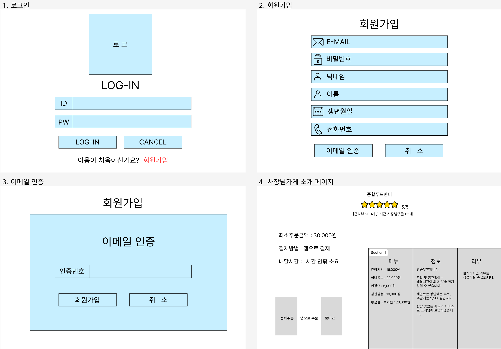
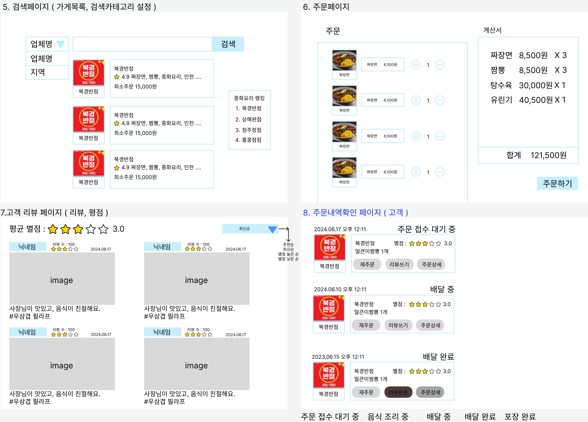
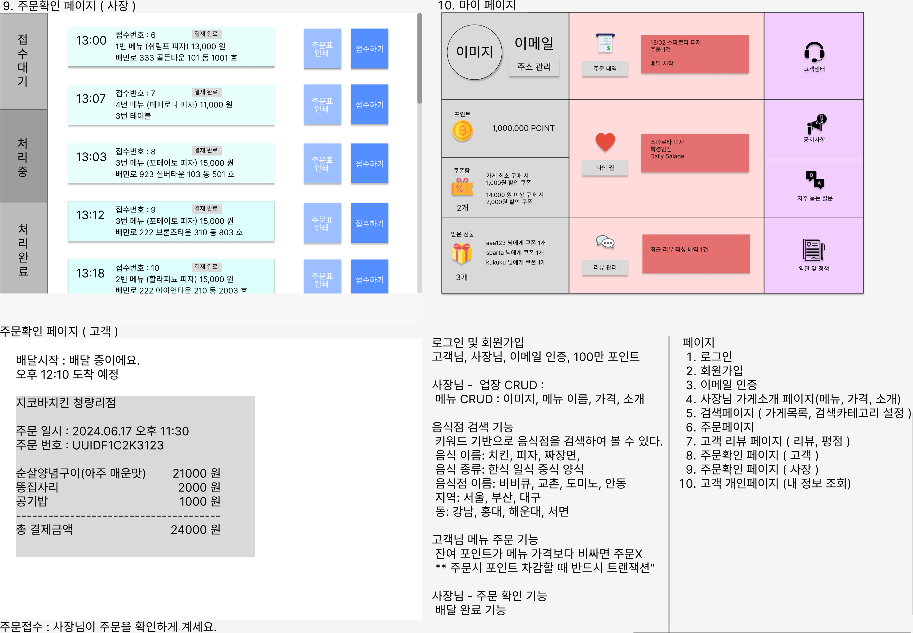

# 팀 차르봄바 - 50Mt으로 너에게 닿기를의 백오피스 프로젝트

## 프로젝트 소개

- 프로젝트 이름 : 너집앞 (너네 집 앞으로 50Mt의 정성으로 간다)
- 내용 : 배달의 민족 서비스를 클론 코딩하여 데이터 베이스 설계부터 서비스 구현 까지 마침.
- 구분 : 팀 프로젝트
- GitHub : https://github.com/KwangSoo1555/sparta-4nd-week-newsfeed
- 시연 영상 : https://www.youtube.com/watch?v=ffhGHyPA7eg
- 배포 : 

 

## 팀원 구성

- 팀장(총통) : 복광수 [@KwangSoo1555](https://github.com/KwangSoo1555)
- 팀원(사령관) : 김영규 [@ykyu99](https://github.com/ykyu99)
- 팀원(총장) : 이강산 [@KangSanLee24](https://github.com/KangSanLee24)
- 팀원(special agent) : 서동현 [@lucetaseo](https://github.com/lucetaseo)

 

## 1. 개발 기간

- 2024.06.17 ~ 2024.06.21

 

## 2. 개발 환경

- 운영체제 : Window/Mac
- FrontEnd : X
- BackEnd : Node.js, Express, MySQL(Prisma), socket.io
- Tool : Visual Studio Code, Insomnia
- Publish : PM2, AWS/RDS, AWS/EC2, AWS/S3

 

## 3. 역할 분배

- **복광수**
  - 회원가입 기능, 로그인, 로그아웃  API
  - nodemailer를 이용한 이메일 인증 API
  - 토큰 재발급 및 미들웨어 API 레이어 패턴 적용
  - 내 정보 조회 및 수정 API
  - 소셜 로그인 API
  - passport를 이용한 네이버 소셜 로그인
- **김영규**
  - 가게 메뉴 소개 페이지 (사장님 권한) CRUD
  - 가게 검색, 및 랭킹 정렬기능
  - 리뷰, 평점 카운트
  - 유저 권한 변경
- **이강산**
  - 고객 리뷰 페이지 CRUD
  - 고객 주문하기(+point 나감)
  - 사장 주문 상태 변경하기 (+point들어옴)
  - AWS S3 구성 및 설정, 배포
  - ERD 작성 및 테이블 스키마 설계
  - 팔로우, 언팔로우 기능
- **서동현**
  - 게시물 댓글 CRUD
  - 게시물 댓글 좋아요/좋아요 취소

 

## 4. API 명세서 및 ERD, 와이어 프레임

- API 명세서 : https://www.notion.so/teamsparta/50-Mt-eb0e8d159d6347ef921fab11e7a95224
- ERD : https://www.erdcloud.com/d/MmTMgZ2oNvapcnbJj
- 와이어프레임 : https://www.figma.com/design/AB9wrnnmUfue8ReWL9VpMZ/5th-backoffice?node-id=0-1&t=Do5HTd2i4ItIbx92-1

 

## 5. 주요 기능 및 설명

### 5-1. 이메일 인증 API

- 회원 가입을 위한 이메일 인증 코드를 반환하는 API입니다.

- 이메일 가입 시 이메일 인증을 위한 Nodemailer와 같은 패키지를 사용했습니다.

- nodemailer.createTransport() 메서드를 통해 메일 발송을 위한 객체를 생성합니다.

- codeObject라는 인증 코드 객체를 통해서 코드의 유효 여부를 판단합니다.

- https://github.com/KwangSoo1555/sparta-5th-week-backoffice/blob/dev/src/routers/auth.router.js#L19

.png)

 

### 5-2. 회원가입 API

- **이메일, 비밀번호, 비밀번호 확인, 별명, 전화번호, 생년월일, 이메일 인증 코드**를 Request Body(**`req.body`**)로 전달 받습니다.

- **보안을 위해 비밀번호는** 평문(Plain Text)으로 저장하지 않고 `Hash` 된 값을 저장합니다.

- https://github.com/KwangSoo1555/sparta-5th-week-backoffice/blob/dev/src/routers/auth.router.js#L23

.png)

 

### 5-3. 로그인 API

- **이메일, 비밀번호**를 Request Body(**`req.body`**)로 전달 받습니다.

- **AccessToken(Payload**에 `사용자 ID`를 포함하고, **유효기한**이 `12시간`)을 생성합니다.

- **RefreshToken(Payload**에 `사용자 ID`를 포함하고, **유효기한**이 `7일`)을 생성합니다.

- **AccessToken**와**RefreshToken**을 반환합니다.

- https://github.com/KwangSoo1555/sparta-5th-week-backoffice/blob/dev/src/routers/auth.router.js#L26

.png)

 

### 5-4. 네이버 소셜 로그인 API

- `OAuth`를 이용한 로그인 API입니다.

- 외부의 로그인 인증 수단을 사용하기 위해 `passport` 모듈을 사용했습니다.

- 사용하기 위해서는 https://developers.naver.com/ 에서 애플리케이션을 등록해야 합니다.

- 로그인 과정

  - `/auth/naver` 라우터를 통해 로그인 요청이 들어오면 `passport.authenticate` 메서드 호출합니다.
  - `naverStrategy 전략` 실행해서 데이터베이스에 사용자 정보를 등록합니다
  - `사용자 ID`를 담은 `JWT 토큰`을 생성해서 클라이언트에게 반환합니다.

- https://github.com/KwangSoo1555/sparta-5th-week-backoffice/blob/dev/src/routers/passport.router.js

.png)
.png)
.png)
.png)

 

### 5-5. 토큰 재발급 API

- `Refresh Token`를 새롭게 발급 API입니다.

- 다른 API와는 다르게 `Refresh Token`을 `헤더`로 받아와서 `DB에 있는 토큰`과 비교합니다.

- 토큰 유효성 검사가 통과하면 새로운 Refresh 토큰을 재발급 받습니다.

- https://github.com/KwangSoo1555/sparta-5th-week-backoffice/blob/dev/src/middlewares/require-refresh-token.middleware.js

.png)

 

### 5-6. 로그아웃 API

- 로그인한 사용자가 로그아웃 하는 API입니다.

- refreshTokenValidator 통해서 로그인한 사용자의 Refresh Token를 검증합니다.

- 토큰 유효성 검사가 통과하면 DB에 있는 기존 Refresh Token을 null값으로 변경합니다.

- 즉, Refresh Token을 폐기하는 것입니다.

- https://github.com/KwangSoo1555/sparta-5th-week-backoffice/blob/dev/src/routers/auth.router.js#L29

.png)

 

### 5-7. 내 정보 조회 API

- 로그인한 사용자의 정보를 조회하는 API입니다.

- `accessTokenValidator`를 통해서 로그인한 사용자의 `Access Token를 검증`합니다.

- 토큰 유효성 검사가 통과하면 `req.user`를 통해 사용자의 정보를 가져옵니다.

- 그대로 조회한 사용자 데이터를 반환합니다.

- https://github.com/KwangSoo1555/sparta-5th-week-backoffice/blob/dev/src/routers/users.router.js#L19

.png)

 

### 5-8. 내 정보 수정 API

- 사용자의 정보를 수정하는 API입니다.

- `이메일, 이름, 수정할 비밀번호, 현재 비밀번호, 전화번호, 주소`를 `req.body`를 통해 받아옵니다.

- 사용자 프로필 사진은 `multer`를 이용해 `AWS S3`에 저장합니다.

- `newPassword(수정할 비밀번호)`가 입력되어 들어올 때만 비밀번호를 수정합니다.

- https://github.com/KwangSoo1555/sparta-5th-week-backoffice/blob/dev/src/routers/users.router.js#L21

.png)

 

### 5-9. 내 권한 수정 API

- 사용자의 권한을 수정하는 API입니다.

- `액세스 토큰을 통헤 추출한 유저정보`를 `req.user`를 통해 받아옵니다.

- 받아온 유저정보를 통헤 사용자의 권한을 변경합니다. (CUSTOMER, OWNER)

- https://github.com/KwangSoo1555/sparta-5th-week-backoffice/blob/dev/src/routers/users.router.js#L25

 

### 5-10. 주문 내역 조회 API

- 사용자의 주문내역을 조회하는 API입니다.

- `액세스 토큰을 통헤 추출한 유저정보를`를 `req.user`를 통해 받아옵니다.

- 받아온 유저정보를 통헤 사용자의 주문내역을 조회합니다.

- https://github.com/KwangSoo1555/sparta-5th-week-backoffice/blob/dev/src/routers/users.router.js#L28

.png)

 

### 5-11. 지역 검색 API

- 검색하고자 하는 지역을 입력 받아 관련 가게 목록을 정렬하는 API입니다.

- `지역명`을 `req.param`를 통해 받아옵니다.

- 지역에 속한 가게를 이름 순으로 정렬합니다.

- https://github.com/KwangSoo1555/sparta-5th-week-backoffice/blob/dev/src/routers/search.router.js#L15

.png)

 

### 5-12. 업체명 검색 API

- 검색하고자 하는 업체명을 입력 받아 관련 가게 목록을 정렬하는 API입니다.

- `업체명`을 `req.param`를 통해 받아옵니다.

- 업체명이 포함된 가게를 이름 순으로 정렬합니다.

- https://github.com/KwangSoo1555/sparta-5th-week-backoffice/blob/dev/src/routers/search.router.js#L17

.png)

 

### 5-13. 키워드 검색 API

- 검색하고자 하는 키워드를 입력 받아 관련 가게 목록을 정렬하는 API입니다.

- `키워드`를 `req.param`를 통해 받아옵니다.

- 키워드가 포함된 가게를 이름 순으로 정렬합니다.

- https://github.com/KwangSoo1555/sparta-5th-week-backoffice/blob/dev/src/routers/search.router.js#L19

.png)

 

### 5-14. 키워드 별 평점 랭킹 API

- 검색하고자 하는 키워드를 입력 받아 관련 가게 목록을 평점순으로 정렬하는 API입니다.

- `키워드`를 `req.param`를 통해 받아옵니다.

- 키워드가 포함된 가게를 평점 순으로 정렬합니다.

- https://github.com/KwangSoo1555/sparta-5th-week-backoffice/blob/dev/src/routers/search.router.js#L21

.png)

 

### 5-15. 주문상태 수정 API

- 사장님이 주문 id를 입력바아 주문의 상태를 변경하는 API입니다.

- `주문 id`을 `req.param`를 통해 받아옵니다.

- 주문 상태는 WAITING, PREPARING ,DELIVERING ,COMPLETE로 변경 가능하다.

- https://github.com/KwangSoo1555/sparta-5th-week-backoffice/blob/dev/src/routers/stores.router.js#L22

.png)

 

### 5-16. 주문 목록 조회 API

- 사장님이 현재까지 들어온 주문의 목록을 조회하는 API입니다.

- https://github.com/KwangSoo1555/sparta-5th-week-backoffice/blob/dev/src/routers/stores.router.js#L25

.png)

 

### 5-17. 가게 생성 API

- 사장님이 가게 정보를 입력받아 가게 정보를 생성하는 API입니다.

- `가게 id`를 `req.param`을 통해 입력받습니다.

- `이름, 주소, 키워드, 썸네일 이미지 주소, 전화번호, 소개글`을 `req.body`을 통해 입력받습니다.

- https://github.com/KwangSoo1555/sparta-5th-week-backoffice/blob/dev/src/routers/stores.router.js#L28

.png)

 

### 5-18. 가게 상세조회 API

- 사장님이 가게 id를 입력받아 가게 정보를 상세조회하는 API입니다.

- `가게 id`을 `req.param`을 통해 입력받습니다.

- https://github.com/KwangSoo1555/sparta-5th-week-backoffice/blob/dev/src/routers/stores.router.js#L30

.png)

 

### 5-19. 가게 수정 API

- 사장님이 가게 정보를 입력받아 가게 정보를 수정하는 API입니다.

- `가게 id`를 `req.param`을 통해 입력받습니다.

- `이름, 주소, 키워드, 썸네일 이미지 주소, 전화번호, 소개글`을 `req.body`을 통해 입력받습니다.

- https://github.com/KwangSoo1555/sparta-5th-week-backoffice/blob/dev/src/routers/stores.router.js#L34

.png)

 

### 5-20. 가게 삭제 API

- 사장님이 가게 정보를 입력받아 가게 정보를 삭제하는 API입니다.

- `가게 id`를 `req.param`을 통해 입력받습니다.

- https://github.com/KwangSoo1555/sparta-5th-week-backoffice/blob/dev/src/routers/stores.router.js#L41

.png)

 

### 5-21. 메뉴 생성 API

- 사장님이 메뉴 정보를 입력받아 메뉴 정보를 생성하는 API입니다.

- `가게 id`를 `req.param`을 통해 입력받습니다.

- `이름, 이미지 주소, 가격, 인기여부`를 `req.body`을 통해 입력받습니다.

- https://github.com/KwangSoo1555/sparta-5th-week-backoffice/blob/dev/src/routers/menus.router.js#L22

.png)

 

### 5-22. 메뉴 조회 API

- 사장님이 메뉴 정보를 입력받아 메뉴 정보를 조회하는 API입니다.

- `가게 id`를 `req.param`을 통해 입력받습니다.

- https://github.com/KwangSoo1555/sparta-5th-week-backoffice/blob/dev/src/routers/menus.router.js#L18

.png)

 

### 5-23. 메뉴 상세조회 API

- 사장님이 메뉴 정보를 입력받아 메뉴 정보를 상세조회하는 API입니다.

- `메뉴 id, 가게 id`를 `req.param`을 통해 입력받습니다.

- https://github.com/KwangSoo1555/sparta-5th-week-backoffice/blob/dev/src/routers/menus.router.js#L20

.png)

 

### 5-24. 메뉴 수정 API

- 사장님이 메뉴 정보를 입력받아 메뉴 정보를 수정하는 API입니다.

- `메뉴 id, 가게 id`를 `req.param`을 통해 입력받습니다.

- `이름, 이미지 주소, 가격, 인기여부`를 `req.body`을 통해 입력받습니다.

- https://github.com/KwangSoo1555/sparta-5th-week-backoffice/blob/dev/src/routers/menus.router.js#L24

 
이미지 파일이 깨짐..

 

### 5-25. 메뉴 삭제 API

- 사장님이 메뉴 정보를 입력받아 메뉴 정보를 삭제하는 API입니다.

- `메뉴 id, 가게 id`를 `req.param`을 통해 입력받습니다.

- https://github.com/KwangSoo1555/sparta-5th-week-backoffice/blob/dev/src/routers/menus.router.js#L26

.png)

 

### 5-26. (고객) 가게 목록 조회 API

- 고객이 가게 목록를 조회하는 API입니다.

- https://github.com/KwangSoo1555/sparta-5th-week-backoffice/blob/dev/src/routers/customer-stores.router.js#L36

.png)

 

### 5-27. (고객) 가게 정보 상세 조회 API

- 고객이 가게 정보를 조회하는 API입니다.

- `메뉴 id`를 `req.param`을 통해 입력받습니다.

- https://github.com/KwangSoo1555/sparta-5th-week-backoffice/blob/dev/src/routers/customer-stores.router.js#L38

.png)

 

### 5-28. (고객) 메뉴 목록 조회 API

- 고객이 가게의 메뉴 목록을 조회하는 API입니다.

- `가게 id`를 `req.param`을 통해 입력받습니다.

- https://github.com/KwangSoo1555/sparta-5th-week-backoffice/blob/dev/src/routers/customer-stores.router.js#L40

.png)

 

### 5-29. (고객) 메뉴 상세 조회 API

- 고객이 가게의 메뉴 목록을 조회하는 API입니다.

- `가게 id, 메뉴 id`를 `req.param`을 통해 입력받습니다.

- https://github.com/KwangSoo1555/sparta-5th-week-backoffice/blob/dev/src/routers/customer-stores.router.js#L47

.png)

 

### 5-29. (고객) 메뉴 상세 조회 API

- 고객이 가게의 메뉴 목록을 조회하는 API입니다.

- `가게 id, 메뉴 id`를 `req.param`을 통해 입력받습니다.

- https://github.com/KwangSoo1555/sparta-5th-week-backoffice/blob/dev/src/routers/customer-stores.router.js#L47

.png)

 

### 5-30. (고객) 주문하기 API

- 고객이 가게에 주문을 요청하는 API입니다.

- `가게 id`를 `req.param`을 통해 입력받습니다.

- `가게 id`를 `req.body`을 통해 입력받습니다.

- https://github.com/KwangSoo1555/sparta-5th-week-backoffice/blob/dev/src/routers/customer-stores.router.js#L42

.png)

 

### 5-31. 고객 리뷰 생성 API

- 해당 가게에 리뷰을 작성하는 API입니다.

- `사용자 ID`는 `accessTokenValidator` 검증을 통과 한 뒤 `req.user`를 통해 받아오고, `가게 ID`는 `req.params`를 통해 URL에서 가져옵니다.

- `리뷰 평점`, `리뷰 내용`, `이미지url` 을 `req.body`를 통해 가져옵니다.

- https://github.com/KwangSoo1555/sparta-5th-week-backoffice/blob/dev/src/routers/reviews.router.js#L21

.png)

 

### 5-32. 고객 리뷰 조회 API

- 해당 가게에 작성된 리뷰들을 조회하는 API입니다.

- 본인 뿐만 아니라 **모든 사용자의 댓글**이 보입니다.

- `상품 게시물의 ID`는 `req.params`를 통해 URL에서 가져옵니다.

- 기본적으로 **별점 높은 리뷰가 먼저** 보입니다.

- https://github.com/KwangSoo1555/sparta-5th-week-backoffice/blob/dev/src/routers/reviews.router.js#L23

.png)

 

### 5-33. 고객 리뷰 수정 API

- 본인이 작성한 리뷰를 수정하는 API입니다.

- `상품 게시물의 ID, 댓글의 ID`는 `req.params`를 통해 URL에서 가져옵니다.

- `리뷰 평점`, `리뷰 내용`, `이미지url` 을 `req.body`를 통해 가져옵니다.

- https://github.com/KwangSoo1555/sparta-5th-week-backoffice/blob/dev/src/routers/reviews.router.js#L25

.png)

 

### 5-34. 고객 리뷰 삭제 API

- 본인이 작성한 댓글을 삭제하는 API입니다.

- `상품 게시물의 ID, 댓글의 ID`는 `req.params`를 통해 URL에서 가져옵니다.

- 해당 ID를 조회하고 삭제를 진행합니다. `(Hard Delete)`

- https://github.com/KwangSoo1555/sparta-5th-week-backoffice/blob/dev/src/routers/reviews.router.js#L27

.png)

 

### 5-35 찜 생성 API
- 사용자가 store를 찜 하게해주는 API 입니다.

- `사용자 ID`는 `accessTokenValidator` 검증을 통과한 후 `req.user`를 통해 받아오고, `storeId`는 `req.params`를 통해 URL에서 가져옵니다.

- 사용자가 이미 찜한 가게를 다시 찜하려고 하면 에러를 반환합니다.

- https://github.com/KwangSoo1555/sparta-5th-week-backoffice/blob/dev/src/routers/dibs.router.js#L19

.png)

 

### 5-36. 사용자가 찜한 가게 목록 조회 API

- 사용자가 찜한 모든 가게의 목록을 조회할 수 있게 해주는 API입니다.

- `사용자 ID`는 `accessTokenValidator` 검증을 통과한 후 `req.user`를 통해 받아옵니다.

- 사용자가 찜한 가게 목록을 성공적으로 조회하면 해당 데이터를 반환합니다.

- https://github.com/KwangSoo1555/sparta-5th-week-backoffice/blob/dev/src/routers/dibs.router.js#L22

.png)

 

### 5-37. 찜 해제 API

- 사용자가 특정 가게에 대해 찜을 해제할 수 있게 해주는 API입니다.

- `사용자 ID`는`accessTokenValidator` 검증을 통과한 후 `req.user`를 통해 받아오고, 가게ID는 `req.params`를 통해 URL에서 가져옵니다.

- 사용자가 찜한 가게를 성공적으로 해제하면 해당 데이터를 반환합니다.

- https://github.com/KwangSoo1555/sparta-5th-week-backoffice/blob/dev/src/routers/dibs.router.js#L28

.png)